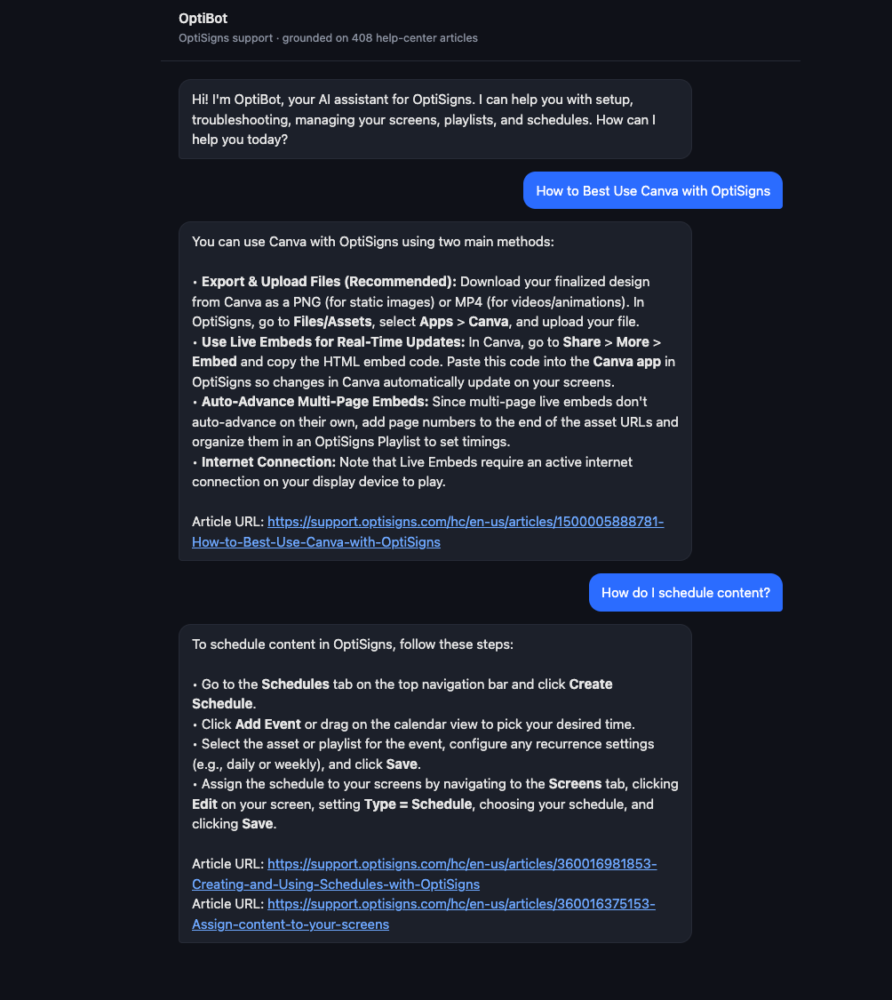

# Support Assistant — daily doc sync

Scrapes a Zendesk help center into Markdown, keeps a **Gemini File Search** vector
store in sync via a daily job, and answers support questions with citations. The
assistant is queried through the Gemini API — a CLI (`ask.js`) and a small local
chat page (`server.js`).

## How it works

```
Zendesk API ──scraper.js──▶ articles/*.md + manifest.json (sha256 per article)
                                     │ hash diff (added/updated/deleted/skipped)
                                     ▼
main.js ──vectorstore.js──▶ Gemini File Search store (upload only the delta)
                                     ▲
ask.js / server.js ── query with File Search tool ──▶ answer + "Article URL:" citations
```

- `config.js` — shared settings (model, store name, workers, system prompt), env-overridable.
- `scraper.js` — fetch all articles, HTML→clean Markdown (nav/ads/images stripped, links/code/headings kept), hash each.
- `vectorstore.js` — Gemini File Search API wrapper (create/list/upload/delete).
- `main.js` — the daily job: scrape, diff against `manifest.json`, upload only new/changed (6-way concurrent), delete removed, log counts, exit 0.
- `ask.js` / `server.js` — query the assistant (CLI, or a local chat UI for demos).
- `store.js` — inspect the vector store (document count, sample titles).

## Setup

```bash
npm install
cp .env.sample .env        # then put your Gemini key in .env
```
Get a free key at https://aistudio.google.com/apikey . No key is committed; `.env` is gitignored.
The scripts auto-load `.env` when present (via Node's `process.loadEnvFile`); in Docker the runtime `-e API_KEY=...` is used instead.

## Run locally

```bash
node main.js                              # scrape + sync the vector store (runs once, exits 0)
node ask.js "How do I add a YouTube video?"   # query the assistant (proof of retrieval + citations)
node server.js                            # local chat UI at http://localhost:3000 (for the demo)
node store.js                             # inspect the vector store (document count, sample titles)
npm test                                  # unit tests (scraper + delta logic)
```

> Note: Gemini File Search stores are API-driven and aren't attachable in the AI Studio
> chat UI. The assistant is therefore exercised programmatically via the Gemini API —
> either `ask.js` (CLI) or `server.js` (a small local chat page for a visual demo). Both
> use the verbatim system prompt + the `minichatbot-doc` store, the Gemini equivalent of
> testing in the Playground.

## Run with Docker

```bash
docker build -t minichatbot-doc .
docker run --rm -e API_KEY=<your-gemini-key> minichatbot-doc   # runs once, exits 0
```

## Daily job

`.github/workflows/daily.yml` runs `main.js` every day at 06:00 UTC (and on demand),
then commits the updated `manifest.json`. Add your key as the repo secret
`GEMINI_API_KEY` (Settings → Secrets → Actions).

**Job logs:** https://github.com/haunn93/minichatbot-doc/actions/workflows/daily.yml

Each run logs, e.g.:
```
delta: added=0 updated=2 deleted=0 skipped=406
uploaded files=2 chunks=11
SUMMARY added=0 updated=2 skipped=406 deleted=0
```

## Chunking strategy

Gemini File Search performs **managed chunking and embedding** on upload — the API
does not expose a per-document chunk count. Files uploaded are logged exactly; the
chunk number is an **estimate** (`size_bytes / 1000`, see `config.CHARS_PER_CHUNK`).
Delta detection is by SHA-256 of each article's Markdown body (stored in `manifest.json`
for change detection only — never sent to the model), so only changed articles are re-embedded.

## System prompt

The assistant runs with a fixed system prompt (defined in `config.js`) that constrains it to:
- answer **only** from the uploaded docs,
- stay concise — max 5 bullet points, else link to the doc,
- cite up to 3 `Article URL:` lines per reply.

## Sample answer

The assistant answering support questions in the local chat UI (`node server.js`),
grounded on the vector store with `Article URL:` citations:


